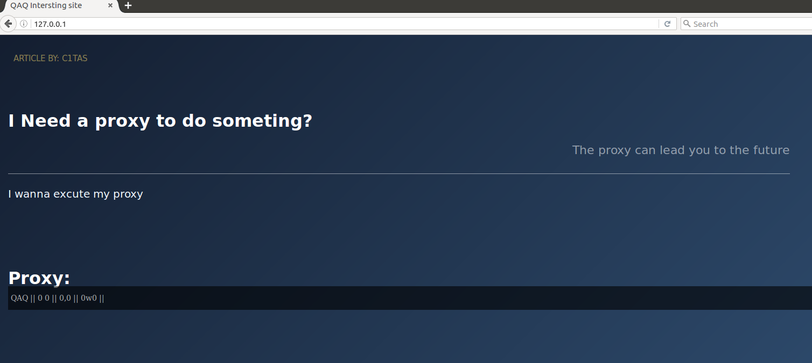

# ENV Introduction

>
- key1: httpoxy
- key2: DNS server
- key3: DNS blind inject

### step1:

httpoxy 

In http header add Proxy:xxxx

and server will execute xxxxx

then find it is a dns server

and you can find the next web server

### step2:

This is the web server with blind inject

only can inject with dns injection

Happy class_fight
